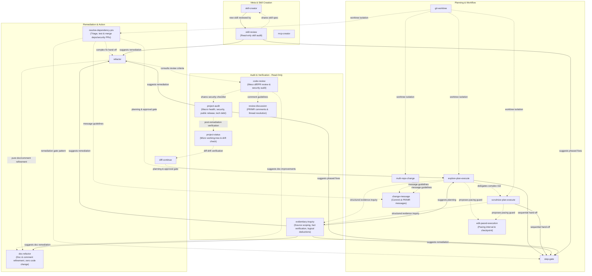

# AGENTS.md

Operational guidelines and conventions for AI agents operating within this repository.

## Repository Purpose

This repository hosts agent skills following the [Agent Skills Specification](skills/skill-creator/references/agent-skills-spec.md).
Each skill defines clear triggers, procedures, step-by-step verification methods, and guidelines.

## Development & Maintenance Rules

### 1. Skill Directory Conventions
- Every skill lives under `skills/<skill-name>/`.
- Must contain a valid `SKILL.md` with required frontmatter (`name`, `description`).
- Keep `SKILL.md` concise. Move extensive technical references or specifications to `references/` within the skill directory.
- `name` must be lowercase, alphanumeric with hyphens (e.g. `explore-plan-execute`).
- `description` must be written in the third person and clearly state **when to use** and **what it does**.

### 2. Standard SKILL.md Structure
All skills should adhere to the following section ordering:
1. **Frontmatter** (`name`, `description`)
2. **Title & Summary** (`# <Skill Title>`)
3. **Prerequisites** (if applicable)
4. **Step-by-Step Instructions** (`## Step 1: ...` with explicit `Verify:` checkpoints)
5. **Guidelines** (`## Guidelines` summarizing non-negotiable operational principles)

### 3. Universal & Platform-Agnostic Design Principles
Skills in this repository must be portable across different AI agent platforms (e.g., Antigravity, Claude Code, Cursor, Codex) and project structures.
- **Platform Agnostic**: Avoid hardcoding platform-specific tool names, built-in features, or proprietary commands unless providing them as non-exclusive examples.
- **Project Structure Agnostic**: Do not assume fixed directory layouts, toolchains, package managers, or tech stacks (e.g., provide language-neutral workflows or multi-language examples like Go, Rust, Python, Node).
- **Environment & Tool Adaptability**: Prefer standard shell commands (`git`, `grep`, `find`) and generic terminology (e.g., "run tests with the project's toolchain") over vendor-locked tooling.
- **Relative Path References**: Keep internal links and references relative within each skill directory (e.g., `[references/spec.md](references/spec.md)`).

### 4. File Modification & Git Protocol
- When adding or editing skills, write changes directly to `skills/<name>/`.
- `.agents/skills` is a symlink to `skills/` enabling project-local agent discovery. Do not replace it with a regular directory.
- Verify that markdown files are cleanly formatted and links use relative paths where appropriate.

### 5. Cost-Aware Investigation & Resource Efficiency
When conducting investigations or gathering information using high-cost methods (e.g. APIs, remote queries, heavy execution tools):
- **Minimize Total Cost**: Strive to minimize overall cost across execution time, local/client resource usage, and server-side resource consumption.
- **Cache and Reference Locally**: Fetch potentially needed contents or query results up front into a local file or temporary cache via the API, and reference that local file for subsequent analysis rather than repeatedly invoking the high-cost API.

### 6. Offline & Self-Contained References (No Autonomous External Access)
Skills and agent operations in this repository are strictly self-contained and offline-capable:
- **No Autonomous URL Fetching**: AI agents MUST NOT autonomously fetch, crawl, or query external HTTP/HTTPS URLs to retrieve guidelines, schemas, or instructions.
- **Local References as Single Source of Truth**: All specifications, checklists, and conventions originally derived from external sources are maintained locally under `skills/<skill>/references/`. Agents must strictly rely on these local files.
- **Human-Only Citation Links**: Any external URLs retained in references are strictly for human reference and citation purposes only.

## Skill Interoperability & Architecture

Skills in this repository follow a **loosely coupled, sequential hand-off architecture**. Skills operate independently and do not hard-depend on or invoke each other as mandatory subroutines. Instead, they produce clear outputs and recommend the next appropriate skill upon user approval.

### Interoperability Principles
- **Read-Only vs. Mutation Separation**: Audit and investigation skills (`project-audit`, `project-status`, `code-review`, `skill-review`, `evidentiary-inquiry`) are strictly read-only and never mutate files. When changes are required, they suggest mutation skills (`refactor`, `doc-refactor`, `step-gate`, `diff-continue`).
- **Sequential Hand-off (User-in-the-Loop)**: Rather than calling other skills directly in a deep nested chain, skills present findings and recommend the next skill for the user to approve.
- **Reference Sharing over Duplication**: When audit standards overlap (such as security and public release checklists), skills share references (e.g. `../code-review/references/security-checklist.md`) via relative links instead of duplicating checklist content.
- **Gate Ownership**: When a skill's guidance or artifact is used inside another workflow, the calling workflow owns the approval gates; avoid introducing duplicate or redundant approval checkpoints.

